# frappe library tutorial

error: en caso de recibier "bench comando no encontrado", añadirlo a ~/.bashrc or ~/.zshrc
```bash
export PATH=$PATH:~/.local/bin

source ~/.zshrc
```

deshabilitar gui debian
```bash
sudo systemctl set-default multi-user.target
sudo reboot
```
volver habilitar
```bash
sudo systemctl set-default graphical.target
```

# Preparacion/instalacion
```bash
apt install git python-dev python3-pip redis-server
apt-get install software-properties-common
apt-get install supervisor
# importante instalar como sudo
sudo pip3 install frappe-bench
```
mariadb
```bash
### versiones anteriores a ubuntu 20.04
apt-key adv --recv-keys --keyserver hkp://keyserver.ubuntu.com:80 0xF1656F24C74CD1D8
add-apt-repository 'deb [arch=amd64,i386,ppc64el] http://ftp.ubuntu-tw.org/mirror/mariadb/repo/10.3/ubuntu xenial main'
```
```bash
apt-get update
apt-get install mariadb-server-10.3
mysql_secure_installation
apt-get install mariadb-client-10.3
mysql_secure_installation
```
```bash
editar el archivo
nano /etc/mysql/my.cnf
```
añadir lo siguiente
```bash
[mysqld]
character-set-client-handshake = FALSE
character-set-server = utf8mb4
collation-server = utf8mb4_unicode_ci

[mysql]
default-character-set = utf8mb4
```
reiniciar el servicio
```bash
systemctl restart mysql
```
### instalacion de nodejs
```bash
curl -o- https://raw.githubusercontent.com/nvm-sh/nvm/v0.39.1/install.sh | bash
```
exportar

```bash
export NVM_DIR="$([ -z "${XDG_CONFIG_HOME-}" ] && printf %s "${HOME}/.nvm" || printf %s "${XDG_CONFIG_HOME}/nvm")"
[ -s "$NVM_DIR/nvm.sh" ] && \. "$NVM_DIR/nvm.sh"
```
```bash
nvm install 14
npm install -g yarn
# or 
sudo apt install yarn -y
sudo apt-get install xvfb libfontconfig wkhtmltopdf
```
# iniciando el proyecto
crear el directorio
```bash
bench init frappe-bench
```
# crear un usuario para frappe en caso de querer trabajar con uno diferente.
```bash
sudo su -
nano /etc/sudoers
admin_dev ALL=(ALL:ALL) NOPASSWD: ALL
```
```bash
sudo apt install nvm
nvm install 14
nvm use 14
```
iniciar el sitio 
```bash
bench start
```
en este punto no hay nada, solo se ejecuta el server

crear una app
```bash
bench new-app library_management
```

crear un site
```bash
bench new-site library.test --db-name 'nombre_de_la_db'
```

al instalar bench se baja la ultima version 14, para el proposito de pruebas y que este similar a la app
en produccion hay que volver a una version anterior v13.
```bash
git remote set-branches upstream '*'
git fetch --all --unshallow
```
se trae todas las versiones

obtener la v13
```bash
bench init 'nombre_proyecto'
# luego lo demas
# es mejor esto
bench init frappe-bench --frappe-branch version-13
# or
bench switch-to-branch 'nombre de la rama'
git checkout -f version-13
bench setup requirements
bench update
```

# instalar nueva app dentro del proyecto actual para integrarlo
```bash
bench new-app 'nombre de la app'
bench --site library.test install-app tienda_prueba
# revisar que la app este junto a la otra(s)
bench --site library.test list-apps
```

```bash
bench update --no-backup --reset
```
`--reset` cambia todos los cambios realizados por del dev

con bench start carga el sitio y realiza un rollup

# añadir el sitio creado para poder correr la app
crear un currentsite.txt en sites/
dentro del archivo añadir el nombre del proyecto
```bash
nano sites/currentsite.txt
```

modificar json para evitar mostrar la pantalla de mantenimiento en el navegador
```bash
nano sites/library.test/site_config.json
{
 "db_name": "_ad03fa1a016ca1c4",
 "db_password": "6w83Hgp1q2JCSop8",
 "db_type": "mariadb",
 "maintenance_mode": 0, # nueva linea
 "pause_sheduler": 0 # nueva linea
}
# or

bench --site library.test set-config developer_mode true
```

# login
user: Adminstrator
pass: (la que solicita al crear el site)

# añadir varios sitios y acceder a ellos con el mismo puerto.
eliminar el currentsite.txt

```bash
rm -f sites/currentsite.txt
```
añadir el sitio al host
```bash
bench --sites library.test add-to-hosts
```
acceder por el nombre del site:port
http://nombre.site:8000

# instalar app del sitio
```bash
bench --site library.test install-app library_management
```

confirmar la instalacion de la app
```bash
bench --site library.test list-apps

```

pasar frape a produccion, supervisor mantiene activo el servicio de bench start.
```bash
sudo bench setup production 'user'
```

en caso de tener problemas o correr el servicio con otro proyecto es:
```bash
sudo supervisorctl stop all
```

si marca error con alguina libreria hacer:
```bash
bench build
```
al iniciar sesion se podra ver el asistente de configuracion

# hacer un push de la app a git
si es el master solo hacer proceso normal.

```bash
cd apps
git checkout -b version-13 # opcional si se trabaja con una rama diferente para hacer un pull request y despues un merge
git init
git add .
git commit -m 'feat(app): push app'
git push origin version-13
```
cargado el modulo a git se puede extraer para cargar en el directorio actual de bench
```bash
# por defecto baja el master
bench get-app library_management git@github.com:taquero-programador/erp-frappe.git
# par obtener una rama diferente
bench get-app library_management git@github.com:taquero-programador/erp-frappe.git branch 'nombre de la rama'
bench update
# si marca error
bench update --no-backup --reset
bench new-site library.test --db-name 'nombre_de_la_db'
bench --site library.test install-app library_management
```

# modo cosola de frappe (pendiente)

# Doctypes

define propiedades y el comportamiento del modelo.

crear un doctype Articulo.
```bash
bench --site library.test mariadb
desc tabArticulo; # es la table del doctype creado

bench --site library.test console
```
los datos pasados como Title automaticamente se pasan con minuscula y separado por `_`

# funciones de tipo de documento (doctype)

evitar el nombre como hash y usar el nombre del item

`field:nombre_item`

ahora el nombre del documento sera el nombre del articulo, por lo que no se puede crear otro articulo con
el mismo nombre.

# Diseño de formulario.

para cambiar la disposicion de los elementos en el formulario, se arrastran tomado la casilla ubicada
en la primera columna.

en la opcion de _configuracion de formulario_ se debe agregar el nombre del field para que la imagen
aparesca a un lado del formulario y se puede modificar.

# Permisos.

puede configurar que roles desea permitir y que acciones desea restringir para un doctype.

ir al tipo de documento _Articulo_, deplazar abajo, *seleccion de permisos* y seleccion de roles.

añadir el rol y crear un usuario que tenga los permisos de ese rol.

niveles 

# Metodos de controlador.

en este punto se realiza un doctype donde se iran añadiendo los miembros de la biblioteca.

los metodos de controladores permiten escribir logica empresarial durante el ciclo de vida de un documento.

en esta parte se creo un doctype "miembor de biblioeta", uno de los balores es `Full name` tipo dato y oculto, este dato al momento de crear el formulario se mantiene oculto.

pasaremos a la parte logica, escribiendo un modulo para manipular el nombre, apellido y obtener el nombre completo del miembro.

modificar el archivo `library_member.py`

> nora-personal (revisar): la logica de python se añade en el directorio de los doctype, el modulo tiene el nombre del doctype

> nota-frappe: si el fragmento de codigo no funcion, ejecutar lo siguiente  `bench --site <your_site> set-config server_script_enabled true`

despues de cargar la logica al sistema y aplicar el comando anterior, el nuevo elemento ya mostrara el fullname

# Tipos de DocTypes.

en esta parte se crea un doctype donde se administrar las membresias de los usuarios existentes, hay un campo `full_name` de tipo solo lectura,
se llenara con el full name del usuario haciendo referencia a `miembro_de_biblioteca.full_name`

> nota-frappe: como en el caso anterior hace referencia a una columan que se genera de manera automatica mediante el first y last,
el doctype de miembros genera un nombre para el item MB.####, si lo cambio por full_name al crear un miembro, me lanzara una
alerta donde requiere el full_name.

# Tipos de documentos vinculados.

Doctypes que estan vinculados a otros como campos de vinculos. se pueden clasificar en **Maestro** y **Transaccional**.

# Tipos de documentos que se pueden vincular.

*is Submittable*: se convierte en un doctype que se puede enviar. Pueden tener 3 estados:
- Borrador: un documento en **Borrador** puede cambia(modificar) en cualquier momento, pero al pasar a **enviado**,
  todos los campos dejan se ser modificables.
- Enviado: el valor de cualquier campo en el documento no se puede cambiar.
- Cancelado: hace el documento invalido.

si se desea modificar un documento se tiene que cancelar, y despues sobre este realizar un duplicado del documento y el doc original
se vinculara al modificado a traves del campo de *modificado desde*.

# Validacion del controlador para la membresia.

crear el doctype **Library Membership**
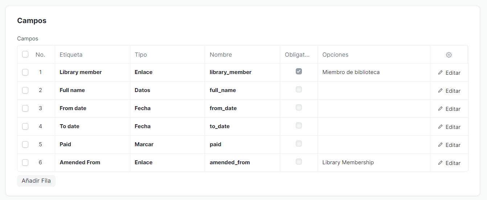

al seleccionar el membro de la biblioteca, retorna el nombre completo.
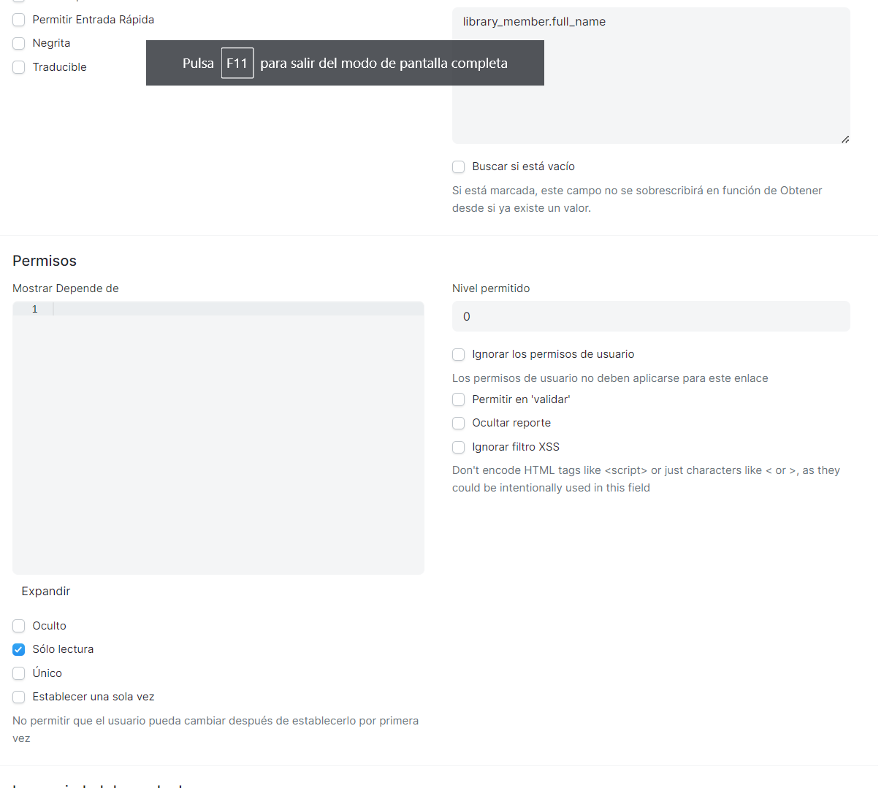

ver configuracion: en la lista de elementos muestra LMS.#### y el ful_name del miembro.
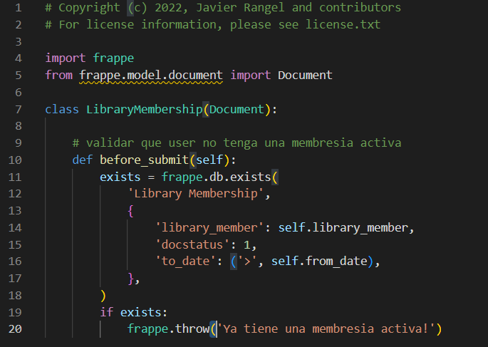

la funcion before_submit comprueba que al crear la membresia el usuari no tenga una activa.
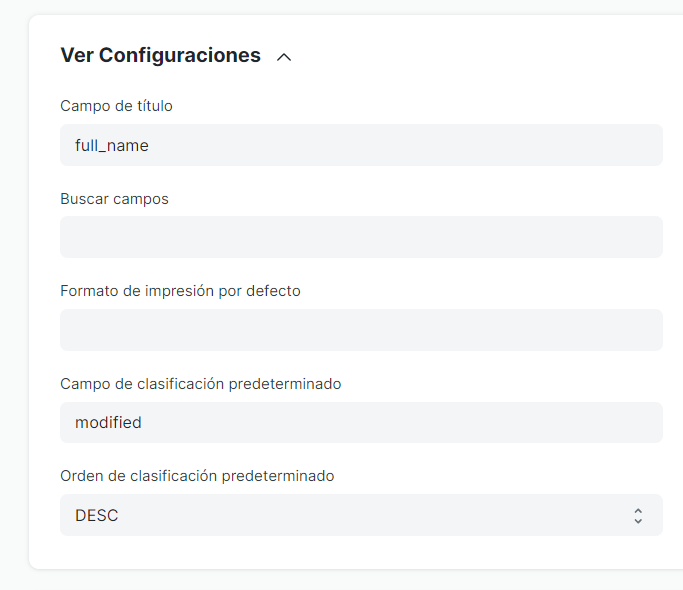

Mensaje mediante la validacion de before_submit.
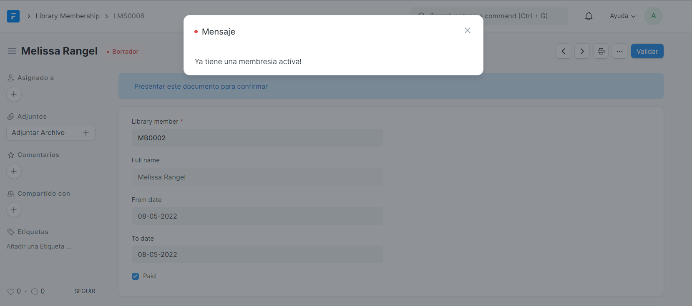

# Transaccion de biblioteca.
crear un doctype para la edicion y devolucion de un libro por parte de un miembro activo.
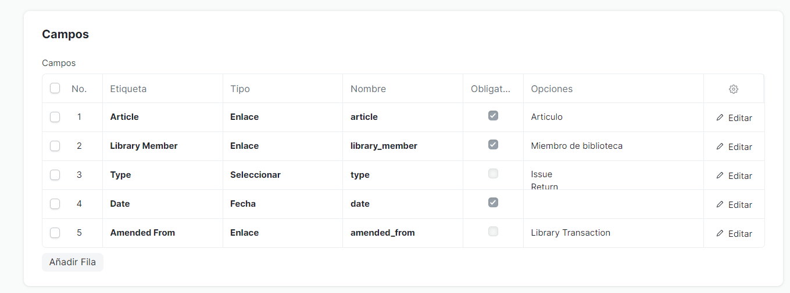

# validacion de transaccion
al publicar un libro debemos validar que el miembro tenga una membresia activa y que el articulo este disponible para
su difucion.

# Library Settings.
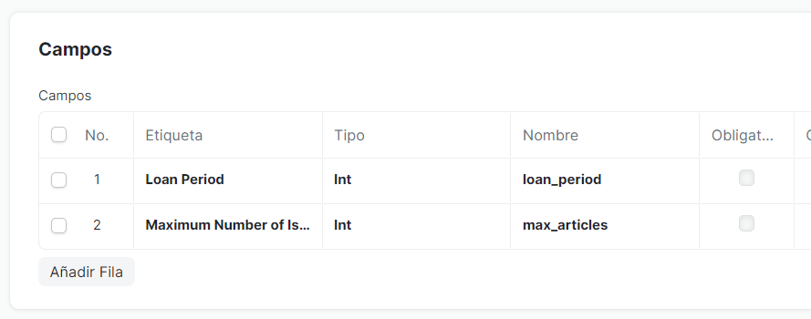

esto no crea una tabla nueva, sino que se almacenan en una misma tabla llamada tabSingles.

hay que establecer los valores predeterminados para el timpo maximo de prestamo y maximo de articulos.
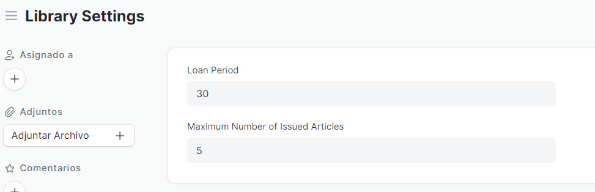

# Validacion de la configuracion de la biblioteca.
cambio en library_membership, que la fecha calcule automaticamente en funcion del periodo de prestamo y from_to.

hacer un cambio en transaccion, que verifique si alcanzo el limite maximo por miembro.

# Guiones de formulario.
los scripts de formularion son codigo js de lado del cliente que mejoran la experiencia de usuario de su formulario.

supongamos que vamos a crear una membresia para un usuario. debe ir a la lista de membresias de biblioteca, crear un
nuevo formulario, seleccionar el miembro, otros campos y luego guardar. De una manera similar para crear una nueva
transaccion para un usario.

mimembro_de_biblioteca.js
```js
frappe.ui.form.on('Miembro de biblioteca', {
    refresh: function(frm) {
        frm.add_custom_button('Create Membership', () => {
            frappe.new_doc('Library Membership', {
                library_member: frm.doc.name
            })
        })
        frm.add_custom_button('Create Transaction', () => {
            frappe.new_doc('Library Transaction', {
                library_member: frm.doc.name
            })
        })
    }
});
```

al ir a miembro de biblioteca para añadir un miembro, debe de mostrar un par de botones en la parte superior derecha.


para cambiar la primera columna por una diferente.
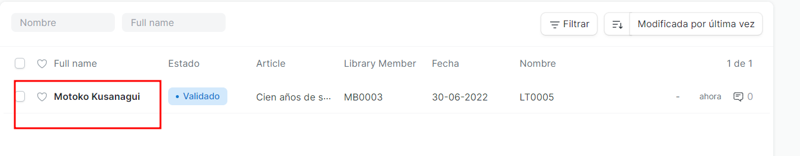

se añade en la siguiente configuracion del doctype.

> nota: si se pasa el nombre al momento de crear otra transaccion con el mismo usario marca error, hay que mejor colocar por un 
id TS.#### y ya en la vista de elementos realizar el acomodo segun sea la necesidad.
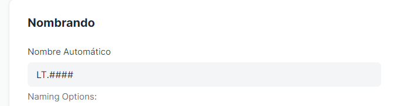

# Paginas de vista web.
paginas renderizadas por el servidor para los visitantes del sitio web.

hasta el momento se a trabajado con la interfaz por defecto DESK, pero para los usario querra dar acceso limitado a los usuarios.
en este caso queremos que los usuarios puedan ver los articulos disponibles que pueden publicar.

añadir nuevos campos en doctype Articulo.
con esto añadido al crear un nuevo articulo la _vista web_ se vera disponible a la izquiera en los nuevos items.
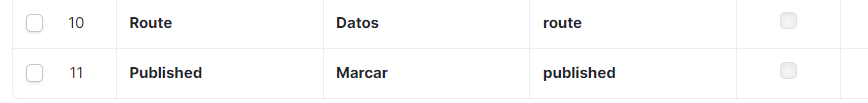

# Personlizar plantilla de vista web.
al activar la vista web se generaron dos nuevos archivos `.html` en templates/.

- articulo.html: trabaja sobre la vista del articulo,
- articulo_row.html: trabaja sobre la vista de todos los items en localhost:8000/articulo.

editar primero article.html (recordar que los nombres se pasan al idioma que se tenga) articulo.html
añadiendo etiquetas html, ahora vamos a cualquier articulo de la lista y le damos vista web, nos debe retornar una vista
del articulo.

de igual manera si se va a localhost:8000/articulo, deberia mostrar una vista muy simple de los articulos.

modificar articulo_row.html

# Apps
frappe apps son paquetes de python, pueden estar en cualquier lado y deben de tener una entrada en `apps.txt`.

# Crear una aplicacion.

# ERPNext

```bash
bench init frappe-bench --frappe-branch version-13
# revisar (aun no tiene nada)
bench start
# new site
bench new-site 'nombre.site'
# get erpnext
bench get-app erpnext --branch version-13
# install app
bench --site 'name_site' install-app 'name_app'
# change password 
bench --site valsa.mx set-admin-password 'new pass'
# hacer un build para reparar dependencias
bench build
# reparar dependencias de python
bench pip install --upgrade rq 'redis' 'vue'
# marco error con vue
bench install requirements
```